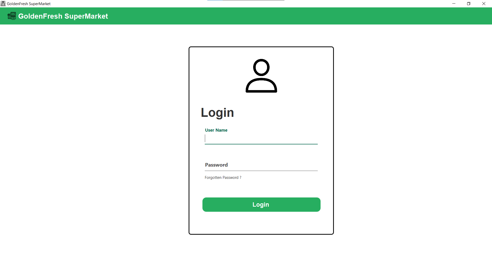
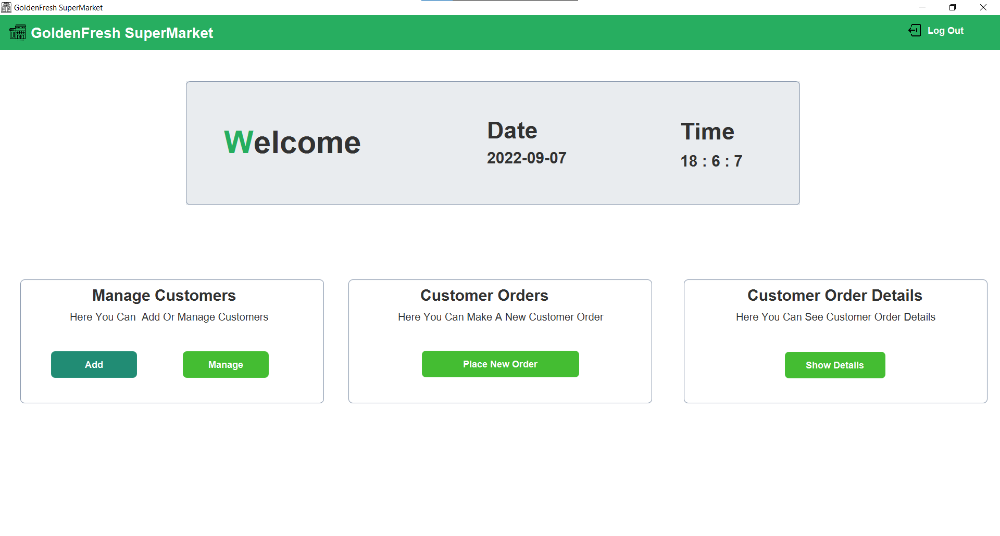
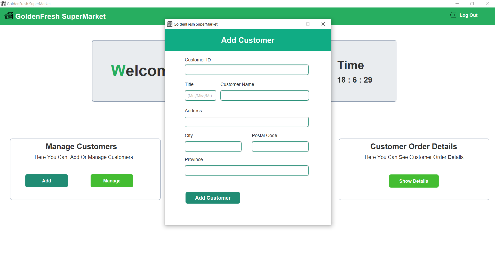
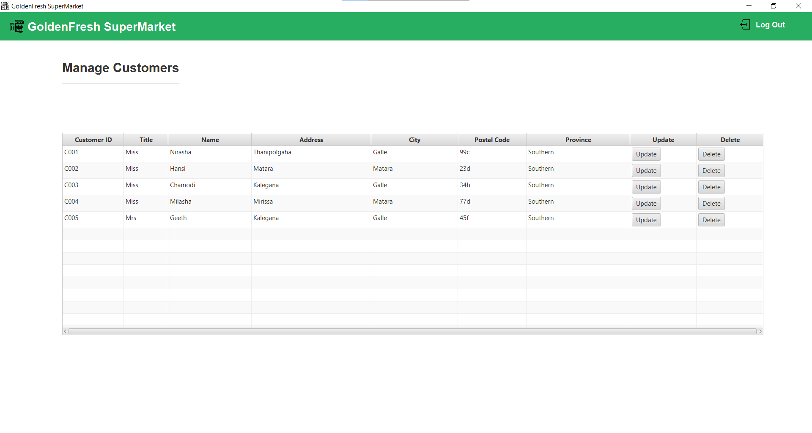
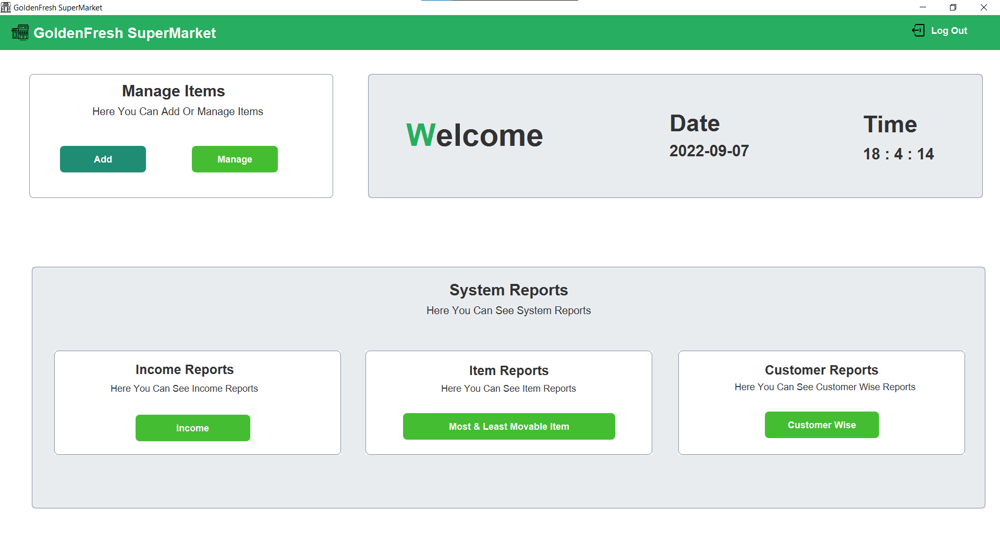
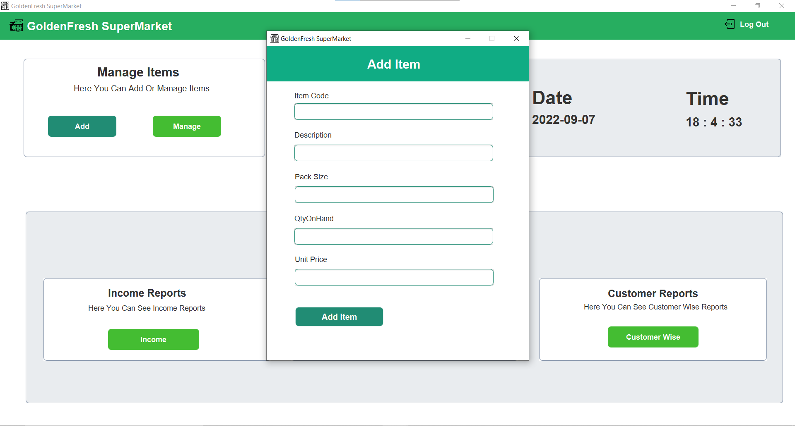
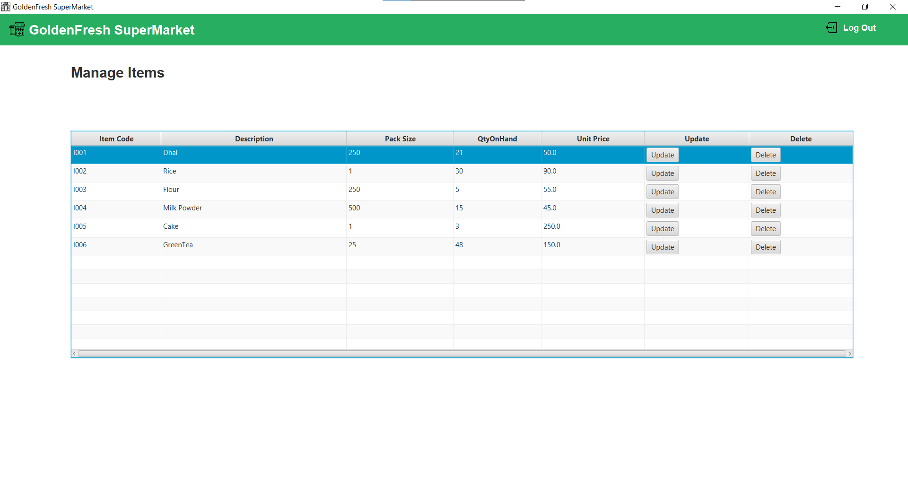
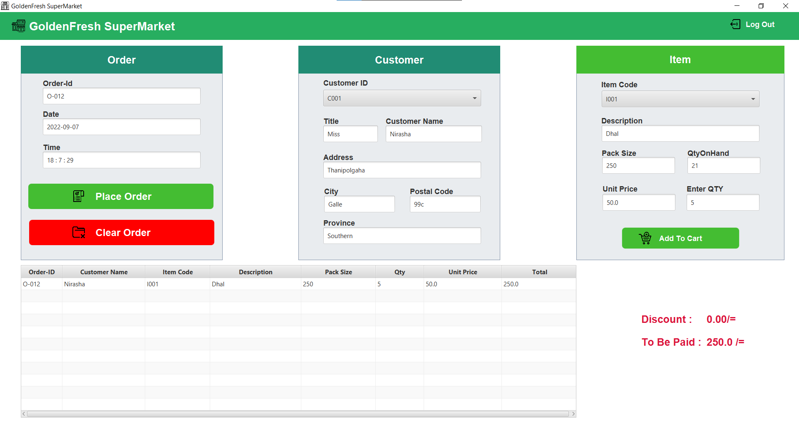
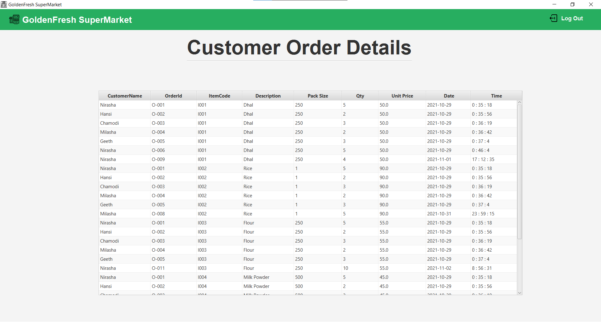
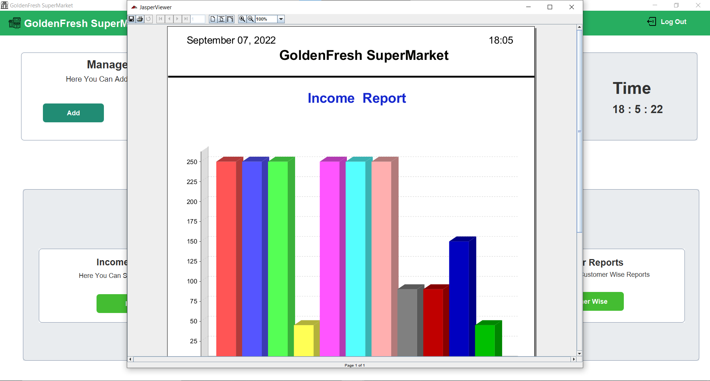

#Layered Marketing 

This is the first project done by using Layered Architecture

*Layered Architecture 
*Java 
*javaFx 
*MySQL 

<b>#Login </b>
 
<b>#Customer DashBoard <b>
 
 
 
<b>#Item DashBoard <b>
 
 
 
<b>#PlaceOrder <b>
 
<b>#Order Details </b>

<b>#Income <b>
 

